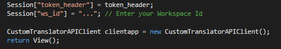

Prerequisites
=============

Create and Register your Azure AD Client App
--------------------------------------------

This sample code uses OAuth and OpenID for authentication. Please sign in to
<https://apps.dev.microsoft.com> with the same user credentials you use to login to 
Custom Translator. The landing page shows the list of client apps that are created/
available to use with your account.

Create an app using “Add an app” button at top right-hand corner of the landing
page.

Enter application name and click on “Create”.

Generate a new password and keep it safe. This is the Application Secret, and
will be used in the application for authentication.

When an application is created, the default delegated permission for it are
“User.Read”.

Add two additional delegated permissions (a) offline_access (b) openid.
These permissions can be added from the “Microsoft Graph Permissions and then Delegated Permissions”
section in the page.

For the MVC web application, a new “Web” platform needs to be added from
“Platforms” section of the page.

Enter the redirect URL for the web platform. This URL is where your
MVC web app should redirect after authentication.

You can ignore the sign-out URL field.

Now save the changes you made and the portal will take you to the landing page,
where all your registered applications are listed. The App Id/ Client ID listed here
will be used to authenticate in the MVC web app.

Provide Consent and Accept Terms
--------------------------------

If you haven't already logged in to [Custom Translator Portal](https://portal.customtranslator.azure.ai) with your user account (the same user
account you used to create/register the AAD app), you will need to login to accept 
the terms and conditions.

After you sign in to [Custom Translator portal](https://portal.customtranslator.azure.ai) with your user account, you will
receive a popup window requesting your consent.

After you’ve provided consent, a popup window for terms will be shown.
Read and accept the terms to continue.

Setup MVC App Code
==================

Open Visual Studio (Run as Administrator) and open
CustomTranslatorSampleCode.sln.

Go to CustomTranslatorSampleCode project and open Controllers and then 
HomeController.cs

Update the values in your code:

1.  clientID: update this value with the App Id/Client ID
    listed in Application Registration Portal.

2.  clientsecret: update this value with your App’s secret/ password.

3.  redirectUri: update it as per your MVC app’s controller URL.

    

4. session Session["ws_id"]: update this variable based on your workspace ID.

    

Build the code and run it in Visual Studio to verify everything is working. If you have not modified any code other than the changes listed above, you should see the landing page of the ASP.NET MVC application.

