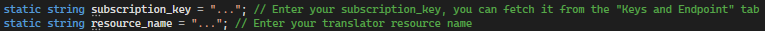
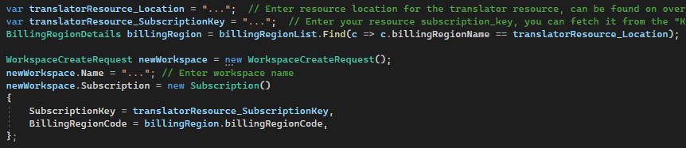
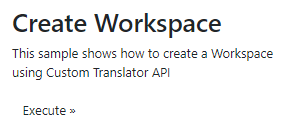
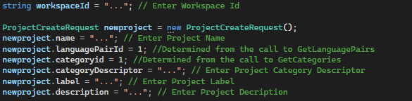
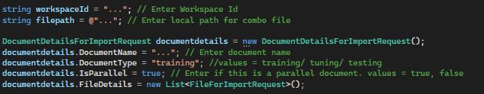
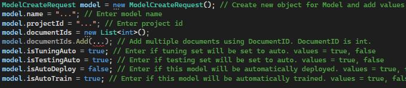

Overview
=============
This sample code provides guidance on how to use the Custom Translator API (preview) using ASP.NET MVC application. Refer to [Custom Translator documentation](https://docs.microsoft.com/en-gb/azure/cognitive-services/translator/custom-translator/overview) to know more about different features of Custom Translator. 

Custom Translator API (preview) documentation can be found [here](https://microsofttranslator.github.io/CustomTranslatorApiSamples).

For support, please select the 'Issues' tab at the top of the page and submit your request.

Prerequisites
=============

Follow the instructions [here](https://learn.microsoft.com/en-gb/azure/cognitive-services/Translator/create-translator-resource) to create a translator resource. 
You will require the resource-name and resource-key (also called subscription key)

Using the API directly using CURL
=================================
| :warning: WARNING          |
|:---------------------------|
| Custom Translator non-interactive API is designed for automated workflows. Once the workspace is created with the API, you cannot view it in Custom Translator Portal. To be able to see the workspace, projects, documents, and models, you should create the workspace using [Custom Translator portal](https://portal.customtranslator.azure.ai/) first then use the API with the workspace Id to upload documents, create projects and train models.   |

<h3>1. Create Workspace</h3>

```bash
curl.exe  -X POST "https://<resource-name>.cognitiveservices.azure.com/translator/customtranslator/api/texttranslator/v1.0/workspaces" --header "Content-Type: application/json" -H "Ocp-Apim-Subscription-Key:<resource-key>" --data "{ 'Name': '<workspace-name>', 'Subscription': { 'SubscriptionKey': '<resource-key>', 'BillingRegionCode': '<billing-region-code>' } }"
```

<h3>2. Get Workspaces</h3>

```bash
curl.exe -X GET "https://<resource-name>.cognitiveservices.azure.com/translator/customtranslator/api/texttranslator/v1.0/workspaces" -H "Ocp-Apim-Subscription-Key:<resource-key>" 
```

<h3>3. Get Supported LanguagePairId</h3>

```bash
curl.exe -X GET "https://<resource-name>.cognitiveservices.azure.com/translator/customtranslator/api/texttranslator/v1.0/languages/supportedlanguagepairs" --header "Content-Type: application/json" -H "Ocp-Apim-Subscription-Key:<resource-key>" 
```

<h3>4. Create Project</h3>

```bash
curl.exe  -X POST "https://<resource-name>.cognitiveservices.azure.com/translator/customtranslator/api/texttranslator/v1.0/projects?workspaceId=<workspace-id>" --header "Content-Type: application/json" -H "Ocp-Apim-Subscription-Key:<resource-key>" --data "{ 'Name': '<project-name>' , 'CategoryDescriptor': '<category-description>', 'CategoryId': '1', 'Description': '<project-description>', 'Label': '', 'LanguagePairId': '1' }"
```
<h5>Notes:</h5>
LanguagePairId, e.g., 1 for en-fr

<h3>5. Get Projects</h3>

```bash
curl.exe   "https://<resource-name>.cognitiveservices.azure.com/translator/customtranslator/api/texttranslator/v1.0/projects?workspaceId=<workspace-id>" --header "Content-Type: application/json" -H "Ocp-Apim-Subscription-Key:<resource-key>"
```

<h3>6.1. Upload Documents - parallel files</h3>

```bash
curl.exe -v --location "https://<resource-name>.cognitiveservices.azure.com/translator/customtranslator/api/texttranslator/v1.0/documents/import?workspaceId=<workspace-id>" --header 'Content-Type: multipart/form-data' --header 'Accept: application/json' -H "Ocp-Apim-Subscription-Key:<resource-key>" --form Files="@filename_en.txt" --form Files="@filename_de.txt" --form 'DocumentDetails="[   {  \"DocumentName\": \"Train1\",  \"DocumentType\": \"Training\",  \"FileDetails\": [ {   \"Name\": \"filename_en.txt\",   \"LanguageCode\": \"en\",   \"OverwriteIfExists\": true }, {   \"Name\": \"filename_de.txt\",   \"LanguageCode\": \"de\",   \"OverwriteIfExists\": true }   ]   } ]"'
```

<h3>6.2. Upload Documents - translation memory (TM)</h3>

```bash
curl.exe --location 'https://<resource-name>.cognitiveservices.azure.com/translator/customtranslator/api/texttranslator/v1.0/documents/import?workspaceId=<workspace-id>' --header 'Content-Type: multipart/form-data' --header 'Accept: application/json' -H "Ocp-Apim-Subscription-Key:<resource-key>" --form 'DocumentDetails="[{\"DocumentName\": \"online-sentence-dictionary\",\"DocumentType\": \"Sentence dictionary\", \"FileDetails\": [{\"Name\":\"sentfix.xlsx\",\"LanguageCode\": \"en\",\"OverwriteIfExists\": true}]}]"' --form 'Files=@"C:\temp\sentfix.xlsx"'
```
<h5>Notes:</h5>
DocumentType: Training, Testing, Tuning, Sentence dictionary, Phrase dictionary 

<h3>7. Get Upload Status</h3>

```bash
curl.exe   "https://<resource-name>.cognitiveservices.azure.com/translator/customtranslator/api/texttranslator/v1.0/documents/import/jobs/<job-id>" --header "Content-Type: application/json" -H "Ocp-Apim-Subscription-Key:<resource-key>"
```

<h3>8. List Documents</h3>

```bash
curl.exe   "https://<resource-name>.cognitiveservices.azure.com/translator/customtranslator/api/texttranslator/v1.0/documents?pageIndex=1&workspaceId=<workspace-id>" --header "Content-Type: application/json" -H "Ocp-Apim-Subscription-Key:<resource-key>"
```

<h3>9. Get Document</h3>

```bash
curl.exe  "https://<resource-name>.cognitiveservices.azure.com/translator/customtranslator/api/texttranslator/v1.0/documents/<document-id>" --header "Content-Type: application/json" -H "Ocp-Apim-Subscription-Key:<resource-key>"
```

<h3>10. Create Model</h3>

```bash
curl.exe  -X POST "https://<resource-name>.cognitiveservices.azure.com/translator/customtranslator/api/texttranslator/v1.0/models" --header "Content-Type: application/json" -H "Ocp-Apim-Subscription-Key:<resource-key>" --data "{ 'Name': '<model-name>', 'ProjectId': '<project-id>',  'DocumentIds': [<document-id-1>, <document-id-2>, <document-id-n>], 'isAutoDeploy': false, 'isTestingAuto': false, 'isTuningAuto': false, 'IsAutoTrain': true }"
```

<h3>11. Get Model Status</h3>

```bash
curl.exe   "https://<resource-name>.cognitiveservices.azure.com/translator/customtranslator/api/texttranslator/v1.0/models/<model-id>" --header "Content-Type: application/json" -H "Ocp-Apim-Subscription-Key:<resource-key>" 
```
<h5>Notes:</h5>
category-id is "apiDomain"

<h3>12. Get Publish Physical Regions</h3>

```bash
curl.exe   "https://<resource-name>.cognitiveservices.azure.com/translator/customtranslator/api/texttranslator/v1.0/regions" --header "Content-Type: application/json" -H "Ocp-Apim-Subscription-Key:<resource-key>" 
```

<h3>13. Deploy the Model</h3>

```bash
curl.exe -X POST "https://<resource-name>.cognitiveservices.azure.com/translator/customtranslator/api/texttranslator/v1.0/models/<model-id>/deployment" --header "Content-Type: application/json" -H "Ocp-Apim-Subscription-Key:<resource-key>" --data '[{"Region": 1, "IsDeployed": true }, {"Region": 2, "IsDeployed": false}, {"Region": 3, "IsDeployed": false}]'
```

<h3>14. Delete the Model (must be in undeployed state)</h3>

```bash
curl.exe --location --request DELETE 'https://<resource-name>.cognitiveservices.azure.com/translator/customtranslator/api/texttranslator/v1.0/models/<model-id>'
```

<h3>15. Delete the Project (should not have model in deployed state)</h3>

```bash
curl.exe --location --request DELETE 'https://<resource-name>.cognitiveservices.azure.com/translator/customtranslator/api/texttranslator/v1.0/projects/<project-id>'
```

<h3>16. Delete the Workspace (should not have any model in deployed state)</h3>

```bash
curl.exe --location --request DELETE 'https://<resource-name>.cognitiveservices.azure.com/translator/customtranslator/api/texttranslator/v1.0/workspaces/<workspace-id>'
```

<h5>Notes:</h5>

  - Physical regions: North America=1, Europe=2, Aisa Pacific=3 
  
  - To Publish model: IsDeployed=true
    
  - To Unpblish model: IsDeployed=false 
 
<h3>14. Get Translation with Category ID</h3>

```bash
curl.exe -X POST "https://<resource-name>.cognitiveservices.azure.com/translator/text/v3.0/translate?api-version=3.0&from=en&to=de&category=<category-id>" -H "Ocp-Apim-Subscription-Key:<resource- key>" -H "Content-Type: application/json" -d "[{'Text':'<text-to-translate>'}]"
```

Setup MVC App Code
==================
| :warning: WARNING          |
|:---------------------------|
| Custom Translator non-interactive API is designed for automated workflows. Once the workspace is created with the API, you cannot view it in Custom Translator Portal. To be able to see the workspace, projects, documents, and models, you should create the workspace using [Custom Translator portal](https://portal.customtranslator.azure.ai/) first then use the API with the workspace Id to upload documents, create projects and train models.   |

Run Visual Studio, open CustomTranslatorSampleCode.sln and expand CustomTranslatorSampleCode.

In **CustomTranslatorAPIClient.cs** update the following code:

1. **subscription_key**: update this value with one of the subscription keys of your translator resource, you can fetch it from the "Keys and Endpoint" tab in the translator resource on azure portal
2. **resource_name**: update this value with your Translator resource's name.



In Controllers folder open WorkspaceController.cs, and update following code:

1. **translatorResource_Location**: Update this value with the location for your translator resource, can be found on overview page of the resource on the azure portal. eg: 'West US 2'
2. **translatorResource_SubscriptionKey**: update this value with one of the subscription keys of your translator resource, you can fetch it from the "Keys and Endpoint" tab in the translator resource on azure portal
3. **newWorkspace.Name**: update this value with desired workspace name.



To create the workspace, start the project in Visual Studio
In the home page, click on "Execute" to create a workspace. This will give you the **WorkspaceId**



Follow the same procedure to execute the changes after each code update.

In Controllers folder open **ProjectController.cs**, go to **Create()** method and update following code:

1. **workspaceId**: update this value with your workspace Id. You can get this by running the "
2. **newproject.name**: update this value desired project name.
3. **newproject.languagePairId**: update this value with appropriate language pair id.
4. **newproject.categoryid**: update this value with appropriate category id.
5. **newproject.categoryDescriptor**: update this value desired project category descriptor.
6. **newproject.label**: update this value desired project label.
7. **newproject.description**: update this value desired project description.



In Controllers folder open **UploadController.cs**, go to **ParallelFile()** method and update following code:

1. **workspaceId**: update this value with your workspace Id.
2. **sourcelanguagefilepath**: update this value of the local path for source language file.
3. **targetlanguagefilepath**: update this value of the local path for source target file.
4. **documentdetails.DocumentName**: update this value with desired document name.
5. **documentdetails.DocumentType**: update this value desired document type. Values can be of training/ tuning/ testing.
6. **sourcelanguagefile.LanguageCode**: update this value with source language code.
7. **sourcelanguagefile.OverwriteIfExists**: if you want to overwrite with this file, if the same file name exists use **true**, else use **false**.
8. **targetlanguagefile.LanguageCode**: update this value with target language code.
9. **targetlanguagefile.OverwriteIfExists**: if you want to overwrite with this file, if the same file name exists use **true**, else use **false**.


In Controllers folder open **UploadController.cs**, go to **ComboFile()** method and update following code:

1. **workspaceId**: update this value with your workspace Id.
2. **filepath**: update this value of the local path for combo file.
3. **documentdetails.DocumentName**: update this value with desired document name.
4. **documentdetails.DocumentType**: update this value desired document type. Values can be of training/ tuning/ testing.



In Controllers folder open **ModelController.cs**, go to **Create()** method and update following code:

1. **model.name**: update this value desired model name.
2. **model.projectId**: update this value with your project id.
3. **model.documentIds.Add()**: add document id in this list. You can add multiple documents.



Build the code and run it in Visual Studio to verify everything is working.
