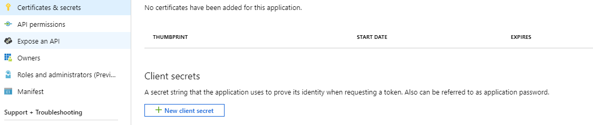
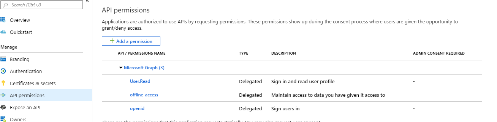
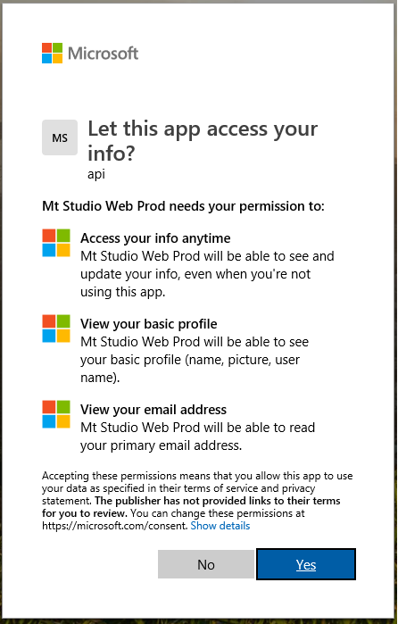
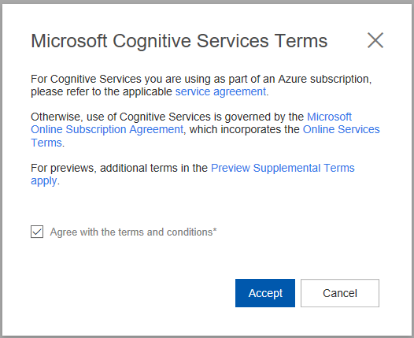
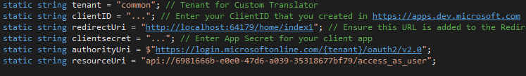
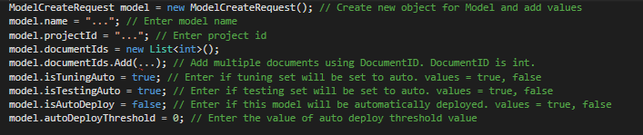
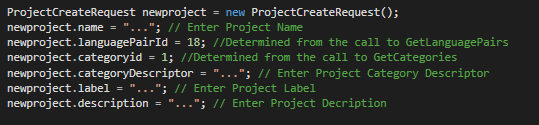
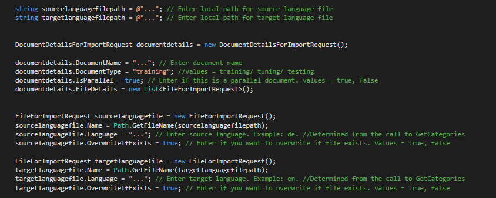
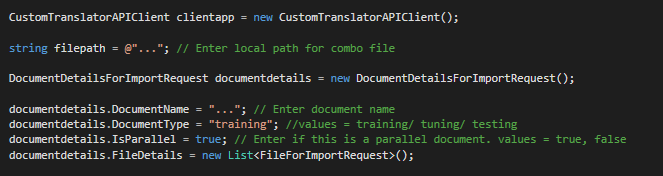

Overview
=============
This sample code provides guidance on how to use the Custom Translator API (preview) using ASP.NET MVC application. Refer to [Custom Translator documentation](https://docs.microsoft.com/en-gb/azure/cognitive-services/translator/custom-translator/overview) to know more about different features of Custom Translator. 

Custom Translator API (preview) documentation can be found [here](https://custom-api.cognitive.microsofttranslator.com/swagger/).

Please contact <custommt@microsoft.com> for questions and support.

Prerequisites
=============

Create and Register your Azure AD Client App
--------------------------------------------

This sample code uses OAuth and OpenID for authentication. Please sign in to
<https://portal.azure.com/#blade/Microsoft_AAD_RegisteredApps/ApplicationsListBlade> with the same user credentials you use to login
to Custom Translator. The landing page shows the list of client apps that are
created/ available to use with your account.

1. Click “New Registration” in the top left corner as in screenshot

2. Enter a unique name for the App ID

3. Select the account type. If you are not sure, click “Help me choose…” to read more on each type.

4. In the redirect URI section, note the following:

* For the MVC web application, select “Web” and enter the Redirect URLs for the web platform. 
* This URL is where your MVC web app should redirect after authentication. 
* You can change Redirect URLs based on your application configuration.

5. Click Register. At this point, you will be directed to an overview page with details about your AppID.

6. Navigate to Certificates and Secrets and click “New client secret”

   This secret along with App ID will be used for authentication as described in “Setup MVC App Code”

7. Navigate to API permissions and click Add permission – Select Microsoft Graph and choose the delegated permissions as shown in screenshot

Provide Consent and Accept Terms
--------------------------------

If you haven't already logged in to [Custom Translator
Portal](https://portal.customtranslator.azure.ai) with your user account (the
same user account you used to create/register the AAD app), you will need to
login to accept the terms and conditions.

After you sign in to [Custom Translator
portal](https://portal.customtranslator.azure.ai) with your user account, you
will receive a popup window requesting your consent.

After you’ve provided consent, a popup window for terms will be shown. Read and
accept the terms to continue.

Setup MVC App Code
==================

Run Visual Studio, open CustomTranslatorSampleCode.sln and expand CustomTranslatorSampleCode.

In Controllers folder open **HomeController.cs**, and update following code:

1. **clientID**: update this value with the App Id/Client ID listed in Application Registration Portal.
2. **clientsecret**: update this value with your App’s secret/ password.
3. **redirectUri**: update it as per your MVC app’s URL.

4.  **session Session["ws_id"]**: update this variable based on your workspace ID.

In Controllers folder open **ModelController.cs**, go to **Create()** method and update following code:

1. **model.name**: update this value desired model name.
2. **model.projectId**: update this value with your project id.
3. **model.documentIds.Add()**: add document id in this list. You can add multiple documents.

In Controllers folder open **ProjectController.cs**, go to **Index()** method and update following code:

1. **newproject.name**: update this value desired project name.
2. **newproject.languagePairId**: update this value with appropriate language pair id.
3. **newproject.categoryid**: update this value with appropriate category id.
4. **newproject.categoryDescriptor**: update this value desired project category descriptor.
5. **newproject.label**: update this value desired project label.
6. **newproject.description**: update this value desired project description.

In Controllers folder open **UploadController.cs**, go to **ParallelFile()** method and update following code:

1. **sourcelanguagefilepath**: update this value of the local path for source language file.
2. **targetlanguagefilepath**: update this value of the local path for source target file.
3. **documentdetails.DocumentName**: update this value with desired document name.
4. **documentdetails.DocumentType**: update this value desired document type. Values can be of training/ tuning/ testing.
5. **sourcelanguagefile.Language**: update this value with source language code.
6. **sourcelanguagefile.OverwriteIfExists**: if you want to overwrite with this file, if the same file name exists use **true**, else use **false**.
7. **targetlanguagefile.Language**: update this value with target language code.
8. **targetlanguagefile.OverwriteIfExists**: if you want to overwrite with this file, if the same file name exists use **true**, else use **false**.

In Controllers folder open **UploadController.cs**, go to **ComboFile()** method and update following code:

1. **filepath**: update this value of the local path for combo file.
2. **documentdetails.DocumentName**: update this value with desired document name.
3. **documentdetails.DocumentType**: update this value desired document type. Values can be of training/ tuning/ testing.

Build the code and run it in Visual Studio to verify everything is working.
