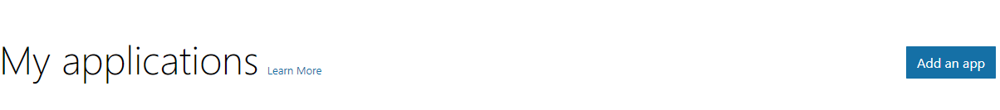
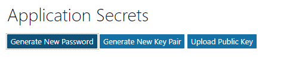
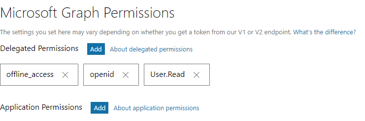
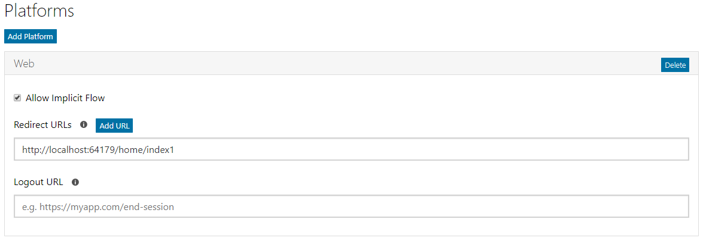
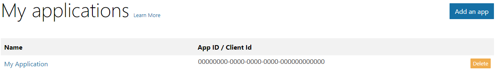
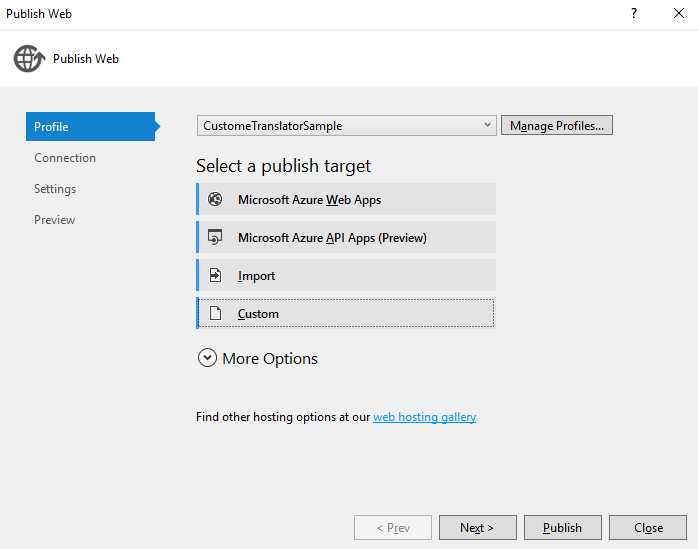
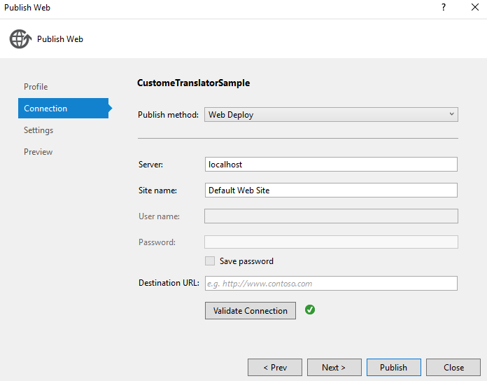
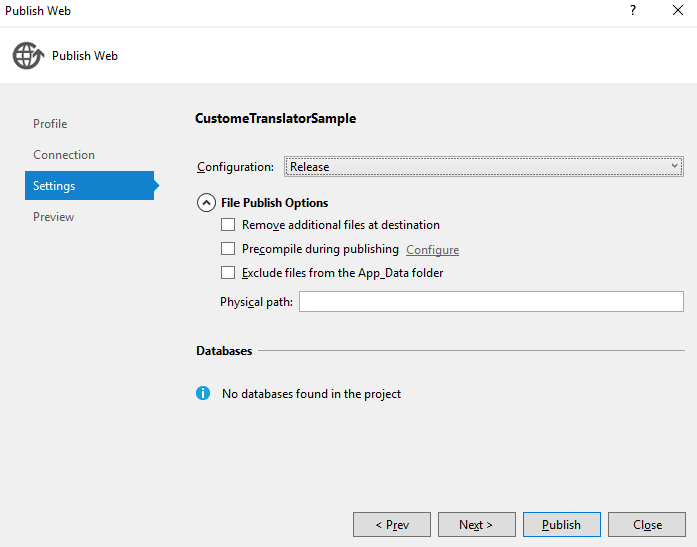
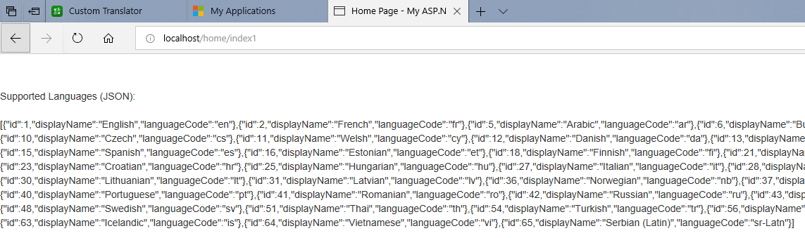

Custom Translator Sample Help

Prerequisites
=============

Create and Register your Azure AD Client App
--------------------------------------------

This sample code uses OAuth and OpenID for authentication. Please login to
<https://apps.dev.microsoft.com> with your user credentials. The landing page
show the list of client app are created/ available to use for the account.

Create an app using “Add an app” button at top right hand corner of the landing
page.

Enter application name and click on “Create”

Generate new password and keep it safe. This is the Application Secret, that
will be used in the application for authentication.

When application is create the default delegated permission gets assigned is
“User.Read”.

Please add two additional delegated permissions (a) offline_access (b) opened.
These can be added from “Microsoft Graph Permissions \>\> Delegated Permissions”
section in the page.

For the MVC web application a new “Web” platform needs to be added from
“Platforms” section of the page.

Please enter the redirect URL for the web platform. This is the URL where your
MVC web app should redirect after authentication.

You can ignore logout URL and can skip entering any value for this field.

Now save the changes you made and the portal will take you to the landing page,
where all your registered applications are listed. The App Id/ Client Id will be
used in the MVC web app as well.

Provide consent and Accept terms
--------------------------------

Please login to Custom Translator portal
(<https://portal.customtranslator.azure.ai>) with your user account, which
you’ve used to create/ register the AAD app and accept terms

After you login to Custom Translator portal
(<https://portal.customtranslator.azure.ai>) with your user account, you shall
receive a popup window for providing your consent.

After you’ve provide the consent the popup window for terms will be shown.
Please read the terms and accept the same.

Setup MVC App Code
==================

Open Visual Studio (Run as Administrator) and open
CustomTranslatorSampleCode.sln

Go to CustomTranslatorSampleCode project and open Controllers \>\>
HomeContraller.cs

Update the values

1.  clientID: update this value with your App ID/ Client Id with the App Id
    listed in Application Registration Portal

2.  clientsecret: update this value with your App’s secret/ password

3.  redirectUri: update it as per your MVC app’s controller URL

Now build the code and run it in Visual Studio to verify everything is working
fine. If you have not changed any other code than above, the app should show the
JSON output of supported languages for Custom Translator.

Deploy the MVC App on local IIS
===============================

If you prefer to deploy and run the web app on local ISS please follow these
steps.

Publish the app from publish wizard using custom profile.

In the connection tab, please enter the Server as “localhost” and Sitename as
“Default Web Site”. Now validate the connection.

Go to setting tab and user configuration as “Release”

Preview the publish settings and files those are being published and then
publish the same.

Open your browser hit <http://localhost/>, and this should run the MVC
application on IIS.

